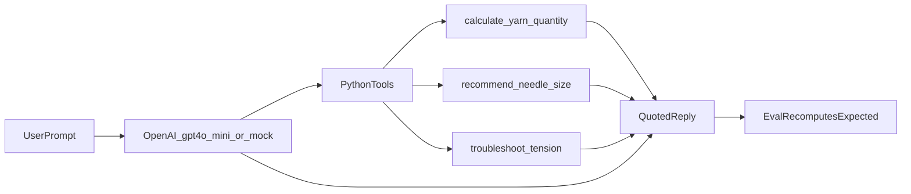
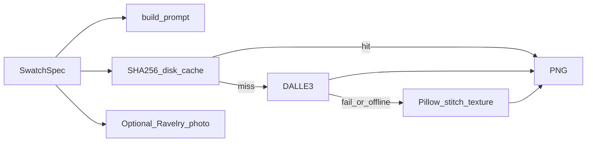

# Knitting app take-home (A + B)

Two Jupyter notebooks for an Engineering Manager review: a knitting assistant that never guesses numbers, and a fabric swatch preview.

- [DECISIONS.md](DECISIONS.md) — what we chose and why
- [LATENCY_NOTE.md](LATENCY_NOTE.md) — how colour taps stay fast
- [DELIVERY_PLAN.md](DELIVERY_PLAN.md) — 6-week plan to ship a real app

## Setup

Python 3.10+ and Jupyter (VS Code / Cursor, JupyterLab, or `jupyter notebook`). Each notebook installs its own packages on first run (`%pip`).

Open and run **top to bottom**:

- [assignment-a/assignment_a.ipynb](assignment-a/assignment_a.ipynb)
- [assignment-b/assignment_b.ipynb](assignment-b/assignment_b.ipynb)

## API keys

Do not commit keys. Copy the example files, then fill in values:

- `assignment-a/.env.example` → `assignment-a/.env`
- `assignment-b/.env.example` → `assignment-b/.env`

**Assignment A** — `assignment-a/.env`:

```env
OPENAI_API_KEY=
OPENAI_MODEL=gpt-4o-mini
OFFLINE_MODE=false
```

**Assignment B** — `assignment-b/.env` (also reads `assignment-a/.env` if present):

```env
OPENAI_API_KEY=
OFFLINE_MODE=false
RAVELRY_ACCESS_KEY=
RAVELRY_PERSONAL_KEY=
```

- `OPENAI_API_KEY` — live chat (A) and DALL·E 3 images (B). Leave empty to run offline.
- `OPENAI_MODEL` — A only. Default `gpt-4o-mini`.
- `OFFLINE_MODE=true` — force offline even if a key is set.
- Ravelry keys — optional photo comparison in B. Skip them; the notebook still runs.

No key: A still does the math and the 15-query test via a mock. B still draws stitch placeholders.

## How it works

### Assignment A — the model does not calculate



The model (or mock) only picks arguments and repeats Python’s numbers. The test table re-runs the same functions to check the reply.

### Assignment B — swatch preview



Cache: `assignment-b/swatch_cache/{hash}.png` (gitignored). Same spec = no new API call.

## With more time

- Move the Python out of the notebooks into a package with tests.
- Fix A’s “yarn for a dog sweater” case so it refuses instead of asking for measurements.
- Confirm which image model the OpenAI account actually allows; keep Pillow as backup.
- Put colour-tint + cache behind a small API so the app can use it.
